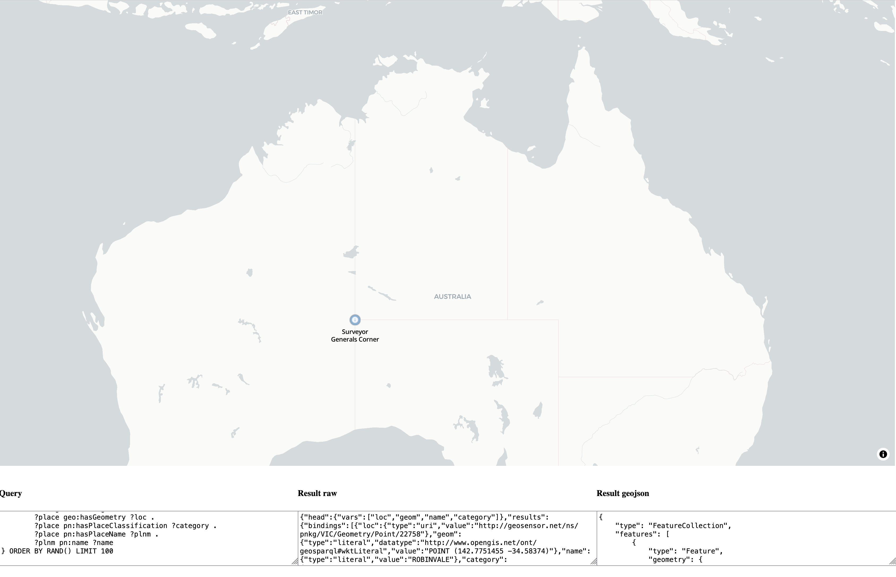

# kgwebmap: Knowledge Graph Web Map
A very simple, single file MapLibre web map to query and map data from a knowledge graph containing GeoSPARQL geometries.

 

## SPARQL end point
The web map retrieves and displays data from a knowledge graph using queries to a SPARQL endpoint. 

[Apache Jena Fuseki](https://jena.apache.org/documentation/fuseki2/) is recommended as an easy-to-use SPARQL endpoint and triple store (graph database). Instructions for [installing Fuseki and creating a knowledge graph](https://medium.com/@rrichajalota234/how-to-apache-jena-fuseki-3-x-x-1304dd810f09) are widely available. OSX users can install in minutes through a [package manager like Homebrew](https://formulae.brew.sh/formula/fuseki), for example. 

This repo also contains some more information on [installing and configuring the Apache Jena Fuseki GeoSPARQL server](geosparql-config.md). 

## SPARQL knowledge graph
An example knowledge graph containing the gazetted placenames for Australia, structured using the [FSDF Placename ontology](https://geoscienceaustralia.github.io/Placenames-Ontology/), can be downloaded from the [RMIT Geographic Knowledge Lab](http://gkl.rmit.melbourne) below:

- [Placenames Australia knowledge graph](http://gkl.rmit.melbourne/kg/pnkg_2025_03_18.ttl)

You can verify your SPARQL endpoint is working correctly by running a simple SPARQL query on the created knowledge graph, such as the one below: 

```
PREFIX pn: <http://linked.data.gov.au/def/placenames/>
PREFIX geo: <http://www.opengis.net/ont/geosparql#> 
SELECT  ?loc ?geom ?name ?category
WHERE   {
        ?loc geo:asWKT ?geom .
        ?place geo:hasGeometry ?loc .
        ?place pn:hasPlaceClassification ?category .
        ?place pn:hasPlaceName ?plnm .
        ?plnm pn:name ?name
}
LIMIT 100
```

## Maplibre web map

The kgwebmap is based on an updated version of the EPFL DHLAB [leaflet-sparql](https://github.com/dhlab-epfl/leaflet-sparql) repo, converted to MapLibre. 

- [kgwebmap html file](kgwebmap.html)
