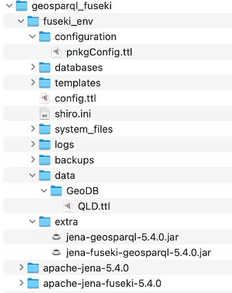

# GeoSPARQL – Fuseki Server Configuration

The following guide provides some guidance on correctly configuring the Apache Fuseki GeoSPARQL server. 

1.	Download Apache Jena binary distributions from 
[https://jena.apache.org/download/](https://jena.apache.org/download/)
- apache-jena-5.4.0
- apache-jena-fuseki-5.4.0

2.	Place both unzipped folders in the same created folder to ease of use (same directory) (e.g., `geosparql_fuseki`)

3.	Create another new folder `fuseki_env` in `geosparql_fuseki` and create only and exactly the following folders as illustrated in the figure below.
- `configuration`
-	`data > GeoDB`
-	`extra`



4.	Create a configuration file as follows and place it in the `configuration` folder. To automatically create a folder inside `fuseki_env`,
provide proper names that match the datasets, such as `PlacenameAus`.

## pnkgConfig.ttl
```
PREFIX fuseki:    <http://jena.apache.org/fuseki#>
PREFIX rdf:       <http://www.w3.org/1999/02/22-rdf-syntax-ns#>
PREFIX rdfs:      <http://www.w3.org/2000/01/rdf-schema#>
PREFIX tdb2:      <http://jena.apache.org/2016/tdb#>
PREFIX ja:        <http://jena.hpl.hp.com/2005/11/Assembler#>
PREFIX geosparql: <http://jena.apache.org/geosparql#>

<#service> rdf:type fuseki:Service;
    fuseki:name "geo";
    fuseki:endpoint [ fuseki:operation fuseki:query; ] ;
    fuseki:dataset <#geo_ds> .

<#geo_ds> rdf:type geosparql:geosparqlDataset ;
    geosparql:spatialIndexFile "YOURPATH/geosparql_fuseki/fuseki_env/databases/PlacenamesAus/spatial.index";
    geosparql:dataset <#baseDataset> .

<#baseDataset> rdf:type tdb2:DatasetTDB2 ;
    tdb2:location YOURPATH/geosparql_fuseki/fuseki_env/databases/PlacenamesAus/" .
```

5.	Download the GeoSPARQL binary files (from [https://repo1.maven.org/maven2/org/apache/jena/jena-geosparql/](https://repo1.maven.org/maven2/org/apache/jena/jena-geosparql/)) and place both jar files in `fuseki_env/extra`

6.	Place the placename knowledge graph turtle file (e.g., QLD.ttl) in `data/GeoDB`

7.	Execute the following commands respectively.

```
/YOURPATH/geosparql_fuseki/apache-jena-5.4.0/bin/tdb2.tdbloader \
--loc=/YOURPATH/geosparql_fuseki/fuseki_env/databases/PlacenamesAus \
/YOURPATH/geosparql_fuseki/fuseki_env/data/GeoDB/QLD.ttl
```
and then
```
FUSEKI_BASE=$HOME/geosparql_fuseki/fuseki_env $HOME/geosparql_fuseki/apache-jena-fuseki-5.4.0/fuseki-server --port=3030
```
 
